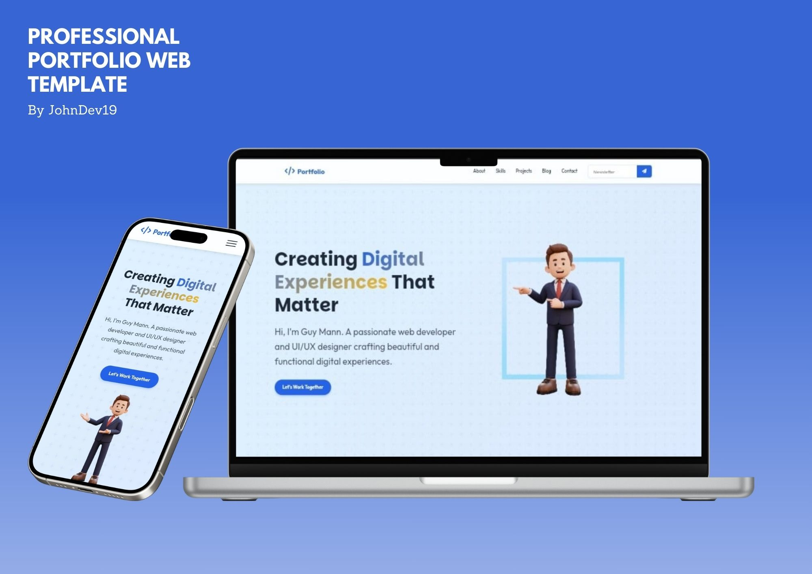
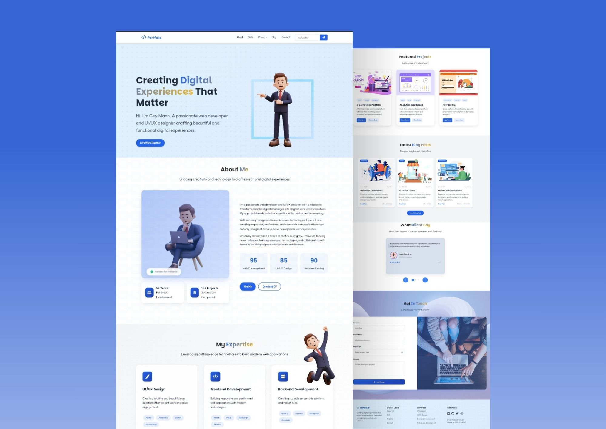

# Guy Mann - Portfolio Web Template

## Overview

This is a professional Web Portfolio Template! I designed it to help individuals showcase their skills, projects, and experiences. This template is perfect for developers, designers, and creatives.

## Table of Contents

1. [Technologies Used](#technologies-used)
2. [Features](#features)
3. [Sections](#sections)
4. [Color Scheme](#color-scheme)
5. [Licensing](#licensing)

## Technologies Used

- HTML5
- CSS3 (Custom Design)
- JavaScript (Vanilla JS)
- Font Awesome Icons
- AOS (Animate on Scroll) Library
- Google Fonts

## Features

- Responsive design for optimal viewing on various devices
- Smooth animations and transitions using AOS
- Interactive sections for skills, projects, and testimonials
- Blog section for sharing insights and updates
- Contact form for potential clients to get in touch

## Sections

- **Header/Navigation**: Easy navigation to different sections of the portfolio.
- **Hero**: Introduction with a call-to-action.
- **About**: Information and approach to web development and design.
- **Skills**: Highlighting expertise in some technologies and tools.
- **Projects**: Featured projects with descriptions and links.
- **Blog**: Latest blog posts.
- **Testimonials**: Client feedback and ratings.
- **Contact**: Form for inquiries and project discussions.
- **Footer**: Quick links, services offered, and contact information.

## Color Scheme

- **Primary Color**:  `#2563eb` (Blue)
- **Secondary Color**:  `#1e40af`
- **Accent Color**:  `#fbbf24`

## Licensing

© 2024 JohnDev19 [LICENSE](LICENSE). All Rights Reserved.

---
